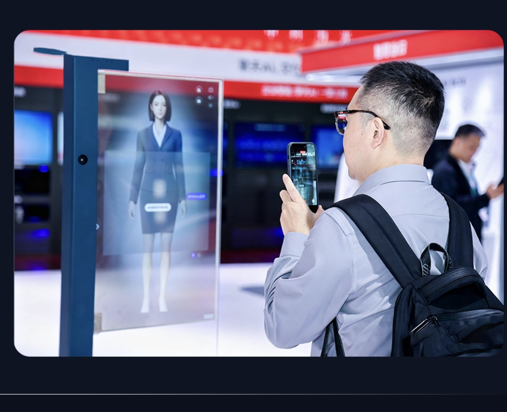
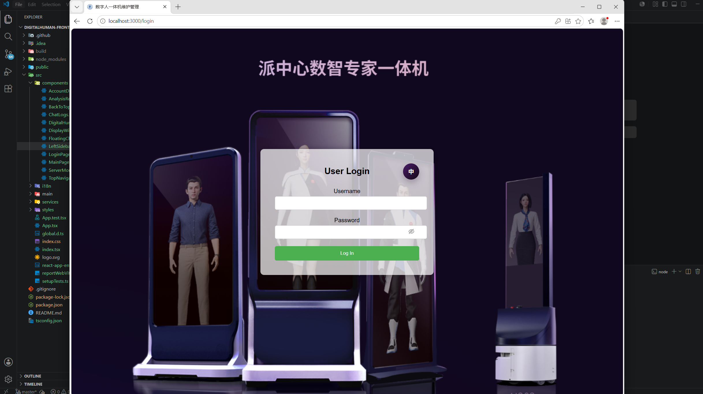
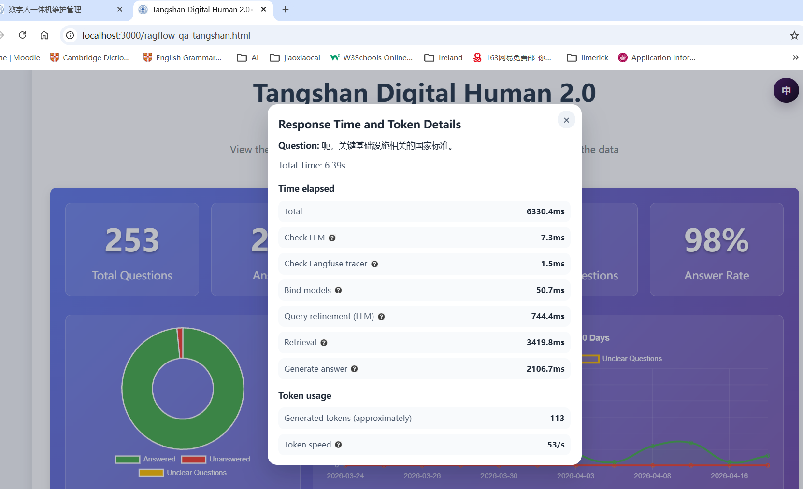
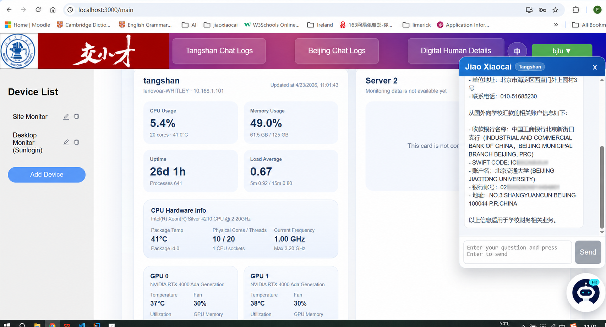

# DigitalHuman

A full-stack digital human service platform for finance consultation, conversation logging, and operations monitoring. The project is a collaboration between Beijing Jiaotong University and Lenovo, built to empower the university's finance department and provide faculty, students, and staff with accessible finance-related Q&A support.

The Q&A experience integrates online large language model APIs, embedding/vector model APIs, and a finance-domain knowledge graph to produce more accurate, traceable, and context-aware answers. The system also records conversation logs, stores detailed interaction metadata, and provides monitoring tools for daily operations and maintenance.



## Project Highlights

- Full-stack project structure with separate `frontend/`, `backend/`, and `database/` modules.
- Digital human consultation workflow for university finance service scenarios.
- Retrieval-augmented Q&A powered by online LLM APIs, vector model APIs, and knowledge graph context.
- Conversation log management for Tangshan and Beijing service scenarios.
- Detailed response analytics, including response time breakdowns and token usage information.
- Floating chatbot interface for finance-related consultation inside the operations dashboard.
- Server and device monitoring features for day-to-day operations management.
- Environment-variable-based backend configuration to avoid committing local database credentials or secrets.

## Repository Structure

```text
DigitalHuman/
|-- backend/              # Spring Boot backend service
|-- frontend/             # React frontend application
|-- database/             # MySQL schema and initialization scripts
|-- docs/                 # Project images and screenshots
`-- README.md             # Project overview and setup guide
```

## Tech Stack

| Layer | Technologies |
| --- | --- |
| Frontend | React, TypeScript, Ant Design, Material UI, Axios, React Router, Chart.js, Recharts |
| Backend | Java 17, Spring Boot, Spring Security, Spring Data JPA, JWT |
| Database | MySQL |
| AI Integration | Online large language model APIs, embedding/vector model APIs, knowledge graph retrieval |
| Monitoring | Server metrics, device monitoring, Tailscale status checks |

## Features

- User login and JWT-based authentication
- Finance consultation through a digital human Q&A interface
- Integration with online LLM and vector retrieval services
- Knowledge graph enhanced answer generation
- Tangshan and Beijing chat log views
- Response time and token usage detail display
- Answered, unanswered, and unclear question statistics
- Server CPU, memory, load, uptime, and hardware monitoring
- Device list management for site and desktop monitoring
- Floating chatbot for finance-related information lookup
- Chinese/English UI language support

## Backend Configuration

The backend configuration is stored in `backend/src/main/resources/application.properties` and supports environment variables.

Common variables:

| Variable | Description |
| --- | --- |
| `DB_URL` | MySQL JDBC URL |
| `DB_USERNAME` | MySQL username |
| `DB_PASSWORD` | MySQL password |
| `JWT_SECRET` | JWT signing secret |
| `INIT_ADMIN_ENABLED` | Whether to initialize an administrator account |
| `INIT_ADMIN_USERNAME` | Initial administrator username |
| `INIT_ADMIN_PASSWORD` | Initial administrator password |

Local private values can be provided through `backend/application-local.properties`, which is intentionally excluded from Git.

## Database Setup

The MySQL initialization script is located at:

```text
database/Mysql数据库账户建表.sql
```

## Local Development

Start the backend service:

```bash
cd backend
mvn spring-boot:run
```

Start the frontend application:

```bash
cd frontend
npm install
npm start
```

## My Role

This project packages a digital human finance consultation scenario into a demonstrable full-stack system. My work focused on organizing the repository, integrating the React frontend with Spring Boot APIs, supporting authentication and conversation records, presenting Q&A analytics, and adding monitoring views for operational maintenance.

## Known Limitations

- Online model and vector API credentials must be configured outside the repository before running the full Q&A workflow.
- Production deployment should provide real database credentials and a strong `JWT_SECRET` through environment variables.
- The included database script is intended for initialization and demonstration; production data is intentionally excluded.
- Some monitoring targets, internal network addresses, and model service endpoints are environment-dependent.

## Screenshots

| Login Screen |
| --- |
|  |

| Q&A Analytics | Operations Monitoring and Chatbot |
| --- | --- |
|  |  |

## Portfolio Summary

This project demonstrates full-stack engineering ability across frontend UI development, backend API design, authentication, database-backed logging, AI service integration, Q&A analytics, and operational monitoring.

Suggested resume entry:

```text
DigitalHuman
Full-stack digital human finance consultation platform built with React, Spring Boot, MySQL, JWT authentication, LLM/vector API integration, knowledge graph retrieval, conversation logging, and operations monitoring.
https://github.com/KFgituser/DigitalHuman
```
